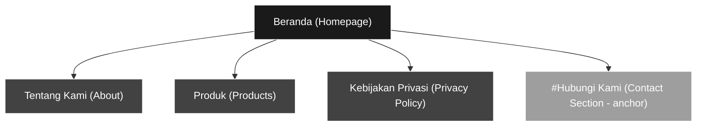
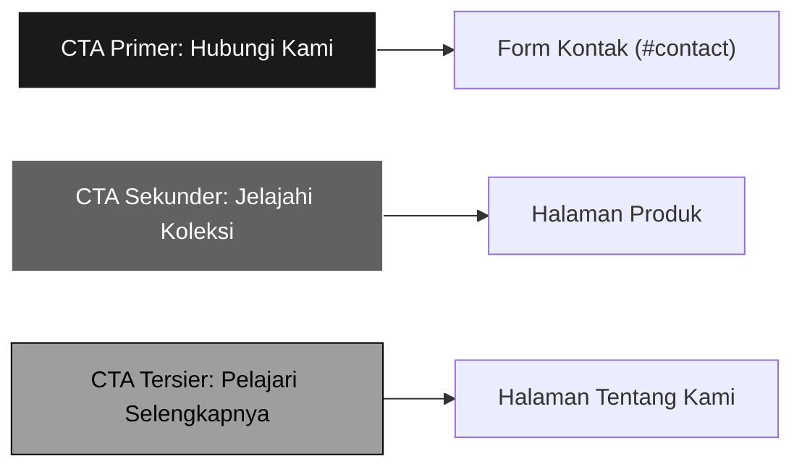
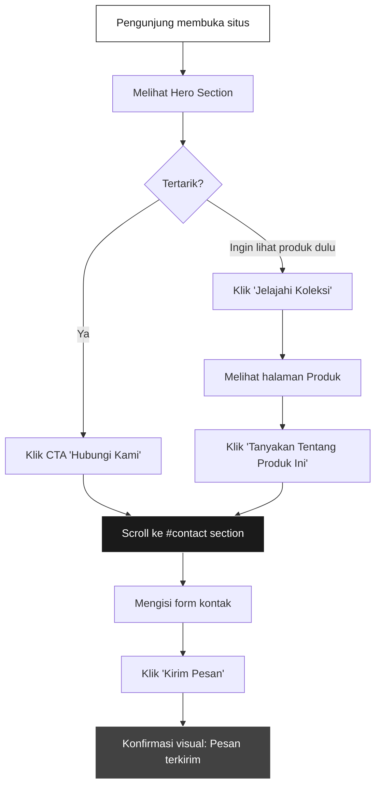
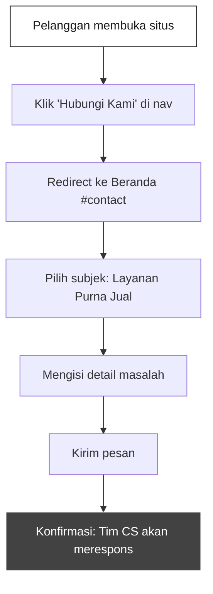

# Product Requirements Document (PRD)
## Situs Web Catch Market

| Field | Detail |
|---|---|
| **Nama Proyek** | Catch Market — Corporate & Customer Support Website |
| **Versi Dokumen** | 1.0 |
| **Tanggal** | 10 Juni 2026 |
| **Status** | Draft — Menunggu Persetujuan Klien |

---

## 1. Ringkasan Eksekutif

Catch Market adalah jaringan toko besar yang menjual perhiasan buatan tangan dengan reputasi tinggi, menargetkan pasangan yang sudah menikah. Situs web ini akan berfungsi sebagai **platform layanan dukungan pelanggan** yang menjelaskan secara jelas apa yang dilakukan perusahaan, sekaligus menjadi kanal utama bagi calon pelanggan untuk menghubungi perusahaan guna mendapatkan informasi lebih lanjut.

Desain menggunakan pendekatan **monokromatik berbasis warna putih** dengan nuansa **misterius namun tetap profesional**, mencerminkan karakter eksklusif dan keahlian artisanal dari produk perhiasan Catch Market.

---

## 2. Latar Belakang & Konteks

### 2.1 Profil Perusahaan

| Aspek | Keterangan |
|---|---|
| **Nama** | Catch Market |
| **Industri** | Ritel Perhiasan (Jewelry Retail) |
| **Tipe Bisnis** | Jaringan toko besar (chain store) |
| **Produk Utama** | Perhiasan buatan tangan (handcrafted jewelry) |
| **Keunggulan Kompetitif** | Reputasi merek & kesan artisanal/handmade |
| **Target Pasar** | Pasangan yang sudah menikah |

### 2.2 Brand Values & Personality

| Dimensi | Deskripsi |
|---|---|
| **Tone of Voice** | Elegan, tenang, penuh percaya diri |
| **Nuansa Utama** | Misterius — membangkitkan rasa ingin tahu, eksklusivitas, dan daya tarik |
| **Kesan Sekunder** | Profesional — terpercaya, mapan, dan berkualitas tinggi |
| **Nilai Inti** | Keahlian tangan (*craftsmanship*), eksklusivitas, keintiman, dan warisan (*heritage*) |

### 2.3 Warna Merek & Panduan Desain

| Elemen | Spesifikasi |
|---|---|
| **Warna Utama (Primary)** | Putih (`#FFFFFF`) |
| **Pendekatan Palet** | Monokromatik — gradasi putih, abu-abu muda, abu-abu medium, hingga hitam |
| **Palet yang Direkomendasikan** | `#FFFFFF` (Putih Murni), `#F5F5F5` (Putih Keabu-abuan), `#E0E0E0` (Abu-abu Terang), `#9E9E9E` (Abu-abu Medium), `#424242` (Abu-abu Gelap), `#1A1A1A` (Hampir Hitam), `#000000` (Hitam) |
| **Rasio Kontras** | Minimum WCAG AA (4.5:1 untuk teks normal) |

> [!IMPORTANT]
> Nuansa "misterius" dicapai melalui penggunaan kontras dramatis antara putih dan hitam, tipografi elegan, ruang negatif yang luas (*whitespace*), dan efek visual subtle seperti bayangan lembut dan gradasi halus — **bukan** melalui warna-warna gelap yang mendominasi.

---

## 3. Tujuan Proyek

### 3.1 Tujuan Bisnis

1. **Menjadi pusat informasi utama** bagi pelanggan baru dan lama tentang Catch Market
2. **Meningkatkan konversi kontak** — mendorong pengunjung untuk menghubungi perusahaan guna informasi lebih lanjut
3. **Memperkuat citra merek** sebagai jaringan perhiasan eksklusif dan tepercaya
4. **Menyediakan layanan dukungan pelanggan** yang mudah diakses secara digital

### 3.2 Tujuan Pengguna

1. Memahami dengan jelas apa yang dilakukan Catch Market
2. Menemukan informasi produk perhiasan dengan mudah
3. Menghubungi perusahaan tanpa hambatan
4. Mendapatkan informasi tentang kebijakan privasi dan perlindungan data

### 3.3 Key Performance Indicators (KPI)

| KPI | Target | Metode Pengukuran |
|---|---|---|
| Contact Form Submission Rate | ≥ 5% dari total pengunjung | Google Analytics Events |
| Bounce Rate Halaman Beranda | ≤ 40% | Google Analytics |
| Waktu Rata-rata di Situs | ≥ 2 menit 30 detik | Google Analytics |
| Halaman per Sesi | ≥ 2.5 halaman | Google Analytics |
| Mobile Usability Score | ≥ 90/100 | Google Lighthouse |

---

## 4. Target Audiens

### 4.1 Persona Utama

#### Persona 1: "Rina & Adi — Pasangan Mapan"

| Atribut | Detail |
|---|---|
| **Usia** | 30–50 tahun |
| **Status** | Menikah, 1–2 anak |
| **Pendapatan** | Menengah-atas |
| **Motivasi** | Mencari perhiasan berkualitas untuk perayaan milestone (anniversary, ulang tahun) |
| **Pain Point** | Sulit membedakan perhiasan buatan tangan asli dari produk massal |
| **Perilaku Digital** | Browsing via smartphone, riset sebelum kunjungan toko |
| **Harapan** | Informasi produk yang jelas, kemudahan menghubungi, kesan eksklusif |

#### Persona 2: "Dimas — Suami yang Mencari Hadiah"

| Atribut | Detail |
|---|---|
| **Usia** | 28–45 tahun |
| **Status** | Menikah |
| **Motivasi** | Mencari hadiah spesial untuk istri |
| **Pain Point** | Tidak terlalu memahami perhiasan, butuh panduan |
| **Perilaku Digital** | Cepat, goal-oriented, ingin langsung kontak atau lihat produk |
| **Harapan** | Navigasi mudah, CTA yang jelas, respons cepat dari tim CS |

### 4.2 Persona Sekunder

- **Pelanggan lama** yang membutuhkan dukungan purna jual
- **Calon mitra bisnis** yang ingin mengetahui profil perusahaan

---

## 5. Arsitektur Informasi

### 5.1 Sitemap



### 5.2 Struktur Navigasi

| Posisi | Elemen | Link Target |
|---|---|---|
| Header Nav 1 | Beranda | `/` atau `/index.html` |
| Header Nav 2 | Tentang Kami | `/about.html` |
| Header Nav 3 | Produk | `/products.html` |
| Header Nav 4 | Hubungi Kami | `/#contact` (scroll ke section) |
| Footer Link | Kebijakan Privasi | `/privacy.html` |

> [!NOTE]
> "Hubungi Kami" di navigasi utama berfungsi sebagai CTA dan akan melakukan smooth-scroll ke bagian kontak di halaman Beranda. Jika pengguna berada di halaman lain, klik akan mengarahkan ke halaman Beranda kemudian scroll ke section kontak.

---

## 6. Spesifikasi Halaman

---

### 6.1 Halaman Beranda (*Homepage*)

**URL:** `/` atau `/index.html`
**Tujuan:** Memberikan gambaran umum perusahaan, membangun kesan pertama, dan mendorong kontak.

#### 6.1.1 Hero Section

| Elemen | Spesifikasi |
|---|---|
| **Visual** | Gambar full-width perhiasan artisanal dengan pencahayaan dramatis di atas latar putih/terang |
| **Headline** | Tagline utama perusahaan, contoh: *"Keindahan yang Diciptakan untuk Anda"* |
| **Sub-headline** | Kalimat singkat menjelaskan value proposition, contoh: *"Perhiasan buatan tangan eksklusif untuk momen berharga Anda"* |
| **CTA Utama** | Tombol: **"Hubungi Kami"** — scroll ke section kontak |
| **CTA Sekunder** | Link teks: *"Jelajahi Koleksi →"* — mengarah ke halaman Produk |
| **Efek Visual** | Subtle parallax scroll, fade-in animasi pada teks, bayangan lembut pada elemen |

#### 6.1.2 Section "Tentang Singkat"

| Elemen | Spesifikasi |
|---|---|
| **Judul** | *"Siapa Kami"* atau *"Cerita di Balik Setiap Karya"* |
| **Konten** | 2–3 paragraf singkat tentang sejarah, visi, dan keunggulan Catch Market |
| **Visual** | Gambar pendukung (proses pembuatan perhiasan / detail artisan) |
| **CTA** | Link: *"Pelajari Selengkapnya →"* — mengarah ke halaman Tentang Kami |

#### 6.1.3 Section "Produk Unggulan"

| Elemen | Spesifikasi |
|---|---|
| **Judul** | *"Koleksi Pilihan"* |
| **Konten** | Grid/carousel menampilkan 3–6 produk unggulan dengan gambar, nama, dan deskripsi singkat |
| **CTA per Produk** | *"Lihat Detail"* — mengarah ke halaman Produk (atau anchor produk spesifik) |
| **CTA Section** | *"Lihat Semua Koleksi →"* — mengarah ke halaman Produk |

#### 6.1.4 Section "Mengapa Catch Market"

| Elemen | Spesifikasi |
|---|---|
| **Judul** | *"Mengapa Memilih Kami"* |
| **Format** | 3–4 kartu ikon dengan judul dan deskripsi singkat |
| **Contoh Poin** | ✦ Buatan Tangan Ahli · ✦ Reputasi Terpercaya · ✦ Eksklusif untuk Anda · ✦ Jaringan Toko Nasional |

#### 6.1.5 Section "Testimoni"

| Elemen | Spesifikasi |
|---|---|
| **Judul** | *"Kata Mereka"* |
| **Format** | Carousel/slider dengan 3–5 testimoni pelanggan |
| **Konten per Slide** | Kutipan, nama pelanggan (inisial/first name), dan kota |

#### 6.1.6 Section "Hubungi Kami" *(Contact Us)* `#contact`

| Elemen | Spesifikasi |
|---|---|
| **Judul** | *"Hubungi Kami"* |
| **Sub-judul** | *"Kami siap membantu Anda menemukan perhiasan yang sempurna"* |
| **Formulir Kontak** | Field: Nama Lengkap, Email, Nomor Telepon, Subjek (dropdown), Pesan |
| **Dropdown Subjek** | Informasi Produk · Pemesanan Khusus · Layanan Purna Jual · Kerjasama · Lainnya |
| **Tombol Submit** | *"Kirim Pesan"* — dengan micro-animation pada hover & konfirmasi visual setelah submit |
| **Informasi Kontak** | Alamat kantor pusat, nomor telepon, email resmi, jam operasional |
| **Peta** | Embed Google Maps lokasi kantor/toko utama |
| **Sosial Media** | Ikon link ke platform sosial media resmi |

> [!TIP]
> Section Hubungi Kami harus menjadi focal point yang kuat. Gunakan kontras visual (misalnya, background sedikit lebih gelap dari section lain) agar menonjol dan mendorong interaksi.

#### 6.1.7 CTA Floating / Sticky

| Elemen | Spesifikasi |
|---|---|
| **Tipe** | Sticky bar di bagian bawah layar (mobile) atau floating button (desktop) |
| **Teks** | *"💬 Hubungi Kami Sekarang"* |
| **Aksi** | Scroll ke `#contact` section |
| **Visibilitas** | Muncul setelah user scroll melewati Hero Section |

---

### 6.2 Halaman Tentang Kami (*About / Information Page*)

**URL:** `/about.html`
**Tujuan:** Menjelaskan secara mendalam tentang perusahaan, sejarah, nilai-nilai, dan keunggulan.

#### Konten Section

| Section | Konten |
|---|---|
| **Hero / Banner** | Judul: *"Tentang Catch Market"* dengan gambar latar bertemakan keahlian tangan |
| **Sejarah Perusahaan** | Timeline atau narasi tentang asal-usul, perjalanan, dan pencapaian |
| **Visi & Misi** | Pernyataan visi dan misi perusahaan |
| **Nilai-Nilai Kami** | Craftsmanship, Eksklusivitas, Kepercayaan, Keintiman |
| **Proses Pembuatan** | Penjelasan visual (gambar/ilustrasi) proses pembuatan perhiasan buatan tangan |
| **Tim / Artisan** | Pengenalan singkat para pengrajin atau tim di balik produk (opsional, jika klien setuju) |
| **Jaringan Toko** | Daftar atau peta lokasi toko-toko Catch Market |
| **CTA Penutup** | *"Ingin Tahu Lebih Lanjut? Hubungi Kami"* — link ke `/#contact` |

---

### 6.3 Halaman Produk (*Products Page*)

**URL:** `/products.html`
**Tujuan:** Menampilkan katalog produk perhiasan untuk mengedukasi pengunjung, bukan sebagai toko online (e-commerce).

> [!IMPORTANT]
> Halaman ini bersifat **katalog/showcase**, bukan transaksi. Tidak ada keranjang belanja atau proses checkout. CTA mengarahkan ke kontak untuk informasi lebih lanjut atau kunjungan ke toko.

#### Konten Section

| Section | Konten |
|---|---|
| **Hero / Banner** | Judul: *"Koleksi Kami"* dengan visual perhiasan premium |
| **Filter / Kategori** | Navigasi kategori: Cincin · Kalung · Gelang · Anting · Set Perhiasan · Edisi Khusus |
| **Grid Produk** | Kartu produk: gambar, nama produk, kategori, deskripsi 1 kalimat |
| **Detail Produk (on-click/modal)** | Galeri gambar, deskripsi lengkap, material, teknik pembuatan, **tidak ada harga** |
| **CTA per Produk** | *"Tanyakan Tentang Produk Ini"* — mengarahkan ke form kontak dengan subjek terisi otomatis |
| **CTA Section Bawah** | *"Tidak menemukan yang Anda cari? Hubungi kami untuk pemesanan khusus"* |

#### Catatan Penting tentang Harga

| Keputusan | Alasan |
|---|---|
| **Harga TIDAK ditampilkan** | Produk buatan tangan bersifat eksklusif dan harga dapat bervariasi. Pendekatan ini mendorong calon pelanggan untuk menghubungi perusahaan (sesuai tujuan CTA). |

---

### 6.4 Halaman Kebijakan Privasi (*Privacy Policy Page*)

**URL:** `/privacy.html`
**Tujuan:** Transparansi pengumpulan dan penggunaan data pengguna, kepatuhan terhadap regulasi.

#### Konten Section

| Section | Konten |
|---|---|
| **Judul** | *"Kebijakan Privasi"* |
| **Tanggal Berlaku** | Tanggal efektif kebijakan |
| **Pendahuluan** | Komitmen Catch Market terhadap perlindungan data pribadi |
| **Data yang Dikumpulkan** | Nama, email, nomor telepon, pesan (dari form kontak); data cookies & analytics |
| **Tujuan Penggunaan Data** | Merespons pertanyaan, meningkatkan layanan, komunikasi pemasaran (dengan consent) |
| **Penyimpanan & Keamanan** | Kebijakan retensi data dan langkah-langkah keamanan |
| **Hak Pengguna** | Hak akses, koreksi, penghapusan data |
| **Cookies** | Penjelasan penggunaan cookies dan opsi pengelolaan |
| **Perubahan Kebijakan** | Prosedur pemberitahuan jika kebijakan berubah |
| **Kontak** | Email atau info kontak untuk pertanyaan terkait privasi |

---

## 7. Komponen Global (Seluruh Halaman)

### 7.1 Header / Navigasi

| Elemen | Spesifikasi |
|---|---|
| **Logo** | Logo Catch Market di kiri, klik mengarah ke Beranda |
| **Menu Navigasi** | Beranda · Tentang Kami · Produk · Hubungi Kami |
| **Gaya** | Transparan di Hero, berubah solid putih saat scroll (sticky header) |
| **Mobile** | Hamburger menu dengan full-screen overlay (efek fade-in, nuansa misterius) |
| **CTA Nav** | Tombol "Hubungi Kami" diberi penekanan visual (border atau background kontras) |

### 7.2 Footer

| Elemen | Spesifikasi |
|---|---|
| **Kolom 1** | Logo, tagline singkat, ikon sosial media |
| **Kolom 2** | Link navigasi: Beranda, Tentang Kami, Produk |
| **Kolom 3** | Kontak: Alamat, Telepon, Email |
| **Kolom 4** | Link legal: Kebijakan Privasi |
| **Baris Bawah** | © 2026 Catch Market. All rights reserved. |
| **Gaya** | Background gelap (`#1A1A1A` atau `#000000`), teks putih/abu-abu terang |

### 7.3 Cookie Consent Banner

| Elemen | Spesifikasi |
|---|---|
| **Posisi** | Bottom bar, muncul saat pertama kali mengunjungi |
| **Teks** | *"Kami menggunakan cookies untuk meningkatkan pengalaman Anda. [Pelajari Selengkapnya]"* |
| **Tombol** | "Terima" dan "Pengaturan" |

---

## 8. Panduan Desain Visual

### 8.1 Skema Warna Monokromatik

```
┌──────────────────────────────────────────────────────────────┐
│                                                              │
│   ██████  #FFFFFF — Putih Murni (Background utama)           │
│   ██████  #F5F5F5 — Off-White (Background alternatif)        │
│   ██████  #E0E0E0 — Abu Terang (Border, divider)             │
│   ██████  #9E9E9E — Abu Medium (Teks sekunder, caption)      │
│   ██████  #616161 — Abu Gelap (Teks body)                    │
│   ██████  #424242 — Charcoal (Heading sekunder)              │
│   ██████  #1A1A1A — Hampir Hitam (Heading utama, footer bg)  │
│   ██████  #000000 — Hitam Murni (Aksen kuat, hover state)    │
│                                                              │
│   Aksen Emas (Minimal):                                      │
│   ██████  #C9B99A — Emas Pudar (Aksen super-halus, opsional) │
│                                                              │
└──────────────────────────────────────────────────────────────┘
```

> [!NOTE]
> Aksen emas (`#C9B99A`) bersifat **opsional** dan hanya digunakan sangat minimal (misalnya, garis dekoratif tipis atau ikon kecil) untuk memperkuat asosiasi perhiasan tanpa mendominasi palet monokromatik putih. **Keputusan penggunaan tergantung persetujuan klien.**

### 8.2 Tipografi

| Level | Font | Weight | Size (Desktop) | Size (Mobile) |
|---|---|---|---|---|
| **Heading 1** | *Playfair Display* atau *Cormorant Garamond* | 700 (Bold) | 48–56px | 32–36px |
| **Heading 2** | *Playfair Display* | 600 (SemiBold) | 36–40px | 24–28px |
| **Heading 3** | *Playfair Display* | 500 (Medium) | 24–28px | 20–22px |
| **Body Text** | *Inter* atau *Lato* | 400 (Regular) | 16–18px | 14–16px |
| **Caption / Label** | *Inter* | 300 (Light) | 12–14px | 11–13px |
| **CTA Button** | *Inter* | 600 (SemiBold) | 14–16px | 14px |
| **Nav Links** | *Inter* | 500 (Medium) | 14–15px | 14px |

> [!TIP]
> Kombinasi serif untuk heading (*Playfair Display*) dan sans-serif untuk body (*Inter*) menciptakan kesan **elegan-misterius di satu sisi, profesional-modern di sisi lain** — sesuai brief klien.

### 8.3 Elemen Visual & Efek "Misterius"

| Elemen | Implementasi |
|---|---|
| **Whitespace** | Penggunaan ruang negatif yang luas untuk kesan eksklusif dan tenang |
| **Bayangan (Shadows)** | Soft shadows (`box-shadow: 0 4px 20px rgba(0,0,0,0.08)`) pada kartu produk dan elemen hover |
| **Gradasi** | Gradient halus putih-ke-abu-abu muda pada section transitions |
| **Garis Dekoratif** | Garis tipis (`1px`) horizontal sebagai pemisah section, warna abu-abu terang |
| **Animasi Masuk** | Fade-in + slide-up halus pada elemen saat scroll (Intersection Observer) |
| **Hover Effects** | Subtle scale (1.02–1.05) + shadow deepening pada kartu produk |
| **Cursor Custom** | Opsional: cursor custom minimalis untuk desktop |
| **Overlay Misterius** | Overlay semi-transparan gelap pada gambar hero untuk kedalaman visual |
| **Tipografi Spacing** | Letter-spacing lebar pada heading untuk kesan mewah (0.05–0.1em) |

### 8.4 Ikonografi

| Aspek | Spesifikasi |
|---|---|
| **Gaya** | Line icons (outline), stroke tipis (1–1.5px) |
| **Library** | Feather Icons, Lucide, atau custom SVG |
| **Warna** | Mengikuti palet monokromatik (abu-abu gelap hingga hitam) |

### 8.5 Fotografi

| Aspek | Panduan |
|---|---|
| **Gaya** | High-contrast, clean background (putih/abu-abu terang), pencahayaan dramatis |
| **Subjek** | Close-up perhiasan, detail tekstur buatan tangan, proses artisanal |
| **Tone** | Desaturated/monokromatik atau near-monochrome agar konsisten dengan palet |
| **Format** | WebP (utama) dengan fallback JPEG, rasio konsisten per section |

---

## 9. User Stories

### 9.1 Pengunjung Baru

| ID | Story | Kriteria Penerimaan |
|---|---|---|
| US-01 | Sebagai pengunjung baru, saya ingin langsung memahami bahwa Catch Market menjual perhiasan buatan tangan, sehingga saya tahu apakah situs ini relevan untuk saya. | Hero section menampilkan tagline + visual perhiasan dalam 3 detik pertama. |
| US-02 | Sebagai pengunjung baru, saya ingin melihat contoh produk perhiasan, sehingga saya bisa menilai kualitas dan gaya. | Section "Produk Unggulan" menampilkan minimal 3 produk dengan gambar. |
| US-03 | Sebagai pengunjung baru, saya ingin dengan mudah menemukan cara menghubungi perusahaan, sehingga saya bisa mendapatkan informasi lebih lanjut. | CTA "Hubungi Kami" terlihat dalam viewport pertama (above the fold). Sticky CTA muncul saat scroll. |

### 9.2 Calon Pelanggan

| ID | Story | Kriteria Penerimaan |
|---|---|---|
| US-04 | Sebagai calon pelanggan, saya ingin mengisi form kontak dengan mudah, sehingga saya bisa bertanya tentang produk tertentu. | Form kontak memiliki max 5 field, validasi real-time, dan konfirmasi visual setelah submit. |
| US-05 | Sebagai calon pelanggan, saya ingin menelusuri kategori produk, sehingga saya bisa menemukan jenis perhiasan yang saya cari. | Filter kategori berfungsi dan menampilkan produk yang relevan. |
| US-06 | Sebagai calon pelanggan, saya ingin mengetahui lokasi toko terdekat, sehingga saya bisa mengunjungi langsung. | Informasi lokasi toko tersedia di halaman Tentang Kami atau section kontak. |

### 9.3 Pelanggan Lama

| ID | Story | Kriteria Penerimaan |
|---|---|---|
| US-07 | Sebagai pelanggan lama, saya ingin menghubungi layanan purna jual, sehingga saya bisa mendapatkan bantuan terkait produk yang sudah dibeli. | Dropdown subjek pada form kontak mencakup opsi "Layanan Purna Jual". |
| US-08 | Sebagai pelanggan lama, saya ingin mengetahui kebijakan privasi, sehingga saya merasa aman dengan data saya. | Halaman Kebijakan Privasi dapat diakses dari footer di semua halaman. |

---

## 10. Strategi Call to Action (CTA)

### 10.1 Hierarki CTA



### 10.2 Penempatan CTA

| Lokasi | Tipe CTA | Teks |
|---|---|---|
| Hero Section | Primer | "Hubungi Kami" |
| Hero Section | Sekunder | "Jelajahi Koleksi →" |
| Setelah "Tentang Singkat" | Tersier | "Pelajari Selengkapnya →" |
| Setelah "Produk Unggulan" | Sekunder | "Lihat Semua Koleksi →" |
| Sticky Bottom Bar (Mobile) | Primer | "💬 Hubungi Kami Sekarang" |
| Floating Button (Desktop) | Primer | "Hubungi Kami" |
| Per Kartu Produk (Halaman Produk) | Primer | "Tanyakan Tentang Produk Ini" |
| Footer Section (semua halaman) | Tersier | Link ke navigasi + kontak |
| Penutup Halaman Tentang Kami | Primer | "Hubungi Kami untuk Informasi Lebih Lanjut" |
| Bawah Grid Produk | Primer | "Tidak menemukan yang Anda cari? Hubungi Kami" |

### 10.3 Desain Tombol CTA

| Tipe | Gaya |
|---|---|
| **Primer** | Background: `#1A1A1A`, Teks: `#FFFFFF`, Border: none, Hover: `#000000` + subtle glow |
| **Sekunder** | Background: transparent, Teks: `#1A1A1A`, Border: `1px solid #1A1A1A`, Hover: fill `#1A1A1A` + teks putih |
| **Tersier** | Background: none, Teks: `#616161`, Underline on hover, Arrow animation (→ slides right) |

---

## 11. Persyaratan Non-Fungsional

### 11.1 Performa

| Metrik | Target |
|---|---|
| First Contentful Paint (FCP) | < 1.5 detik |
| Largest Contentful Paint (LCP) | < 2.5 detik |
| Cumulative Layout Shift (CLS) | < 0.1 |
| First Input Delay (FID) | < 100ms |
| Google Lighthouse Performance Score | ≥ 90 |

### 11.2 Responsivitas

| Breakpoint | Lebar | Catatan |
|---|---|---|
| Mobile | 320px – 767px | Single column, hamburger nav, sticky bottom CTA |
| Tablet | 768px – 1023px | 2-column grid, sidebar nav optional |
| Desktop | 1024px – 1440px | Multi-column, full nav, floating CTA |
| Large Desktop | > 1440px | Max-width container (1440px), centered |

### 11.3 Aksesibilitas (WCAG 2.1 AA)

| Persyaratan | Implementasi |
|---|---|
| Kontras warna | Minimum 4.5:1 untuk teks normal, 3:1 untuk teks besar |
| Navigasi keyboard | Semua elemen interaktif dapat diakses via Tab/Enter |
| Screen reader | Semantic HTML, ARIA labels, alt text pada semua gambar |
| Focus indicators | Visible focus ring pada semua elemen interaktif |
| Form labels | Semua field memiliki label yang terhubung (`<label for>`) |

### 11.4 SEO

| Persyaratan | Implementasi |
|---|---|
| Title tags | Unik per halaman, mengandung keyword + brand name |
| Meta description | 150–160 karakter, deskriptif, mengandung CTA |
| Heading hierarchy | Satu `<h1>` per halaman, hierarki logis H1→H6 |
| Semantic HTML | `<header>`, `<nav>`, `<main>`, `<section>`, `<article>`, `<footer>` |
| Structured Data | JSON-LD: Organization, LocalBusiness, Product (tanpa harga) |
| Open Graph | og:title, og:description, og:image per halaman |
| Sitemap XML | Auto-generated, submitted ke Google Search Console |
| robots.txt | Dikonfigurasi dengan benar |

### 11.5 Keamanan

| Persyaratan | Implementasi |
|---|---|
| HTTPS | SSL/TLS wajib di seluruh situs |
| Form Protection | CSRF token, rate limiting, honeypot anti-spam |
| Input Validation | Server-side validation untuk semua form input |
| Content Security Policy | CSP headers dikonfigurasi |

### 11.6 Browser Support

| Browser | Versi Minimum |
|---|---|
| Chrome | 2 versi terakhir |
| Firefox | 2 versi terakhir |
| Safari | 2 versi terakhir |
| Edge | 2 versi terakhir |
| Samsung Internet | 2 versi terakhir |
| iOS Safari | 2 versi terakhir |

---

## 12. Persyaratan Teknis

### 12.1 Technology Stack (Rekomendasi)

| Layer | Teknologi |
|---|---|
| **Frontend** | HTML5, CSS3 (Vanilla), JavaScript (ES6+) |
| **Styling** | Vanilla CSS dengan CSS Custom Properties (variabel) |
| **Animasi** | CSS Transitions/Animations + Intersection Observer API |
| **Form Handling** | JavaScript + backend API atau layanan form (Formspree, Netlify Forms) |
| **Hosting** | Static hosting (Netlify, Vercel, atau shared hosting) |
| **Analytics** | Google Analytics 4 (GA4) |
| **Maps** | Google Maps Embed API |

### 12.2 Struktur Folder Proyek

```
catch-market-website/
├── index.html                 # Halaman Beranda
├── about.html                 # Halaman Tentang Kami
├── products.html              # Halaman Produk
├── privacy.html               # Halaman Kebijakan Privasi
├── css/
│   ├── variables.css          # CSS Custom Properties (design tokens)
│   ├── reset.css              # CSS Reset/Normalize
│   ├── global.css             # Global styles
│   ├── components.css         # Reusable component styles
│   ├── layout.css             # Layout & grid system
│   └── pages/
│       ├── home.css           # Styles khusus Beranda
│       ├── about.css          # Styles khusus Tentang Kami
│       ├── products.css       # Styles khusus Produk
│       └── privacy.css        # Styles khusus Kebijakan Privasi
├── js/
│   ├── main.js                # JavaScript utama
│   ├── navigation.js          # Navigasi & mobile menu
│   ├── animations.js          # Scroll animations
│   ├── form.js                # Form validation & submission
│   └── products.js            # Product filtering
├── assets/
│   ├── images/
│   │   ├── logo/
│   │   ├── hero/
│   │   ├── products/
│   │   ├── about/
│   │   └── icons/
│   └── fonts/                 # Web fonts (jika self-hosted)
├── sitemap.xml
├── robots.txt
└── favicon.ico
```

---

## 13. Wireframe Deskriptif

### 13.1 Halaman Beranda — Layout Desktop

```
┌─────────────────────────────────────────────────────────────────────┐
│  [Logo]          Beranda   Tentang Kami   Produk   [Hubungi Kami]  │ ← Header
├─────────────────────────────────────────────────────────────────────┤
│                                                                     │
│                    ╔═══════════════════════════╗                     │
│                    ║   HERO IMAGE (Full-Width)  ║                    │
│                    ║                            ║                    │
│                    ║  "Keindahan yang Diciptakan ║                   │
│                    ║       untuk Anda"          ║                    │
│                    ║                            ║                    │
│                    ║  [Hubungi Kami]             ║                    │
│                    ║  Jelajahi Koleksi →         ║                    │
│                    ╚═══════════════════════════╝                     │
│                                                                     │
├─────────────────────────────────────────────────────────────────────┤
│                                                                     │
│  TENTANG SINGKAT                                                    │
│  ┌──────────────────────┐  ┌──────────────────────────────────┐     │
│  │                      │  │  "Cerita di Balik Setiap Karya"  │     │
│  │     [Gambar Proses]  │  │                                  │     │
│  │                      │  │  Paragraf tentang Catch Market... │     │
│  │                      │  │  Pelajari Selengkapnya →          │     │
│  └──────────────────────┘  └──────────────────────────────────┘     │
│                                                                     │
├─────────────────────────────────────────────────────────────────────┤
│                                                                     │
│  PRODUK UNGGULAN  "Koleksi Pilihan"                                 │
│  ┌──────────┐  ┌──────────┐  ┌──────────┐  ┌──────────┐            │
│  │ [Gambar] │  │ [Gambar] │  │ [Gambar] │  │ [Gambar] │            │
│  │ Nama     │  │ Nama     │  │ Nama     │  │ Nama     │            │
│  │ Desc     │  │ Desc     │  │ Desc     │  │ Desc     │            │
│  │ [Detail] │  │ [Detail] │  │ [Detail] │  │ [Detail] │            │
│  └──────────┘  └──────────┘  └──────────┘  └──────────┘            │
│                  Lihat Semua Koleksi →                               │
│                                                                     │
├─────────────────────────────────────────────────────────────────────┤
│                                                                     │
│  MENGAPA CATCH MARKET                                               │
│  ┌────────────┐ ┌────────────┐ ┌────────────┐ ┌────────────┐       │
│  │  ✦ Icon    │ │  ✦ Icon    │ │  ✦ Icon    │ │  ✦ Icon    │       │
│  │  Buatan    │ │  Reputasi  │ │  Eksklusif │ │  Jaringan  │       │
│  │  Tangan    │ │  Terpercaya│ │  untuk Anda│ │  Nasional  │       │
│  └────────────┘ └────────────┘ └────────────┘ └────────────┘       │
│                                                                     │
├─────────────────────────────────────────────────────────────────────┤
│                                                                     │
│  TESTIMONI  "Kata Mereka"                                           │
│  ┌─────────────────────────────────────────────────────────┐        │
│  │  ← "Perhiasan dari Catch Market sangat istimewa..."  → │        │
│  │       — Rina S., Jakarta                                │        │
│  └─────────────────────────────────────────────────────────┘        │
│                                                                     │
├─────────────────────────────────────────────────────────────────────┤
│                                                                     │
│  HUBUNGI KAMI  #contact                    (Background: #F5F5F5)    │
│  ┌──────────────────────────────┐  ┌──────────────────────────┐     │
│  │  Form:                       │  │  Informasi Kontak:       │     │
│  │  [Nama Lengkap         ]     │  │  📍 Alamat kantor        │     │
│  │  [Email                ]     │  │  📞 +62-xxx-xxxx         │     │
│  │  [Nomor Telepon        ]     │  │  ✉️  info@catchmarket.id  │     │
│  │  [Subjek          ▼   ]     │  │  🕐 Sen-Sab, 09:00-18:00 │     │
│  │  [Pesan                ]     │  │                          │     │
│  │  [                     ]     │  │  [Google Maps Embed]     │     │
│  │  [Kirim Pesan         ]     │  │                          │     │
│  └──────────────────────────────┘  └──────────────────────────┘     │
│                                                                     │
├─────────────────────────────────────────────────────────────────────┤
│  FOOTER  (Background: #1A1A1A)                                      │
│  [Logo] Tagline    | Navigasi       | Kontak          | Legal      │
│  [Social Icons]    | Beranda        | Alamat          | Privasi    │
│                    | Tentang Kami   | Telepon         |            │
│                    | Produk         | Email           |            │
│  ─────────────────────────────────────────────────────────────      │
│  © 2026 Catch Market. All rights reserved.                          │
└─────────────────────────────────────────────────────────────────────┘
```

---

## 14. User Flow Utama

### 14.1 Flow: Pengunjung Baru → Kontak



### 14.2 Flow: Pelanggan Lama → Dukungan



---

## 15. Konten & Copywriting Guidelines

### 15.1 Tone of Voice

| Prinsip | Contoh Benar ✅ | Contoh Salah ❌ |
|---|---|---|
| **Elegan** | "Setiap karya kami menyimpan cerita" | "Perhiasan kami bagus banget!" |
| **Misterius** | "Temukan keindahan yang tersembunyi" | "Kami punya banyak produk keren" |
| **Profesional** | "Dengan pengalaman puluhan tahun..." | "Kita udah lama di bisnis ini" |
| **Hangat** | "Kami siap membantu Anda menemukan..." | "Isi form di bawah sekarang!" |
| **Inklusif** | "Untuk momen berharga bersama" | "Untuk wanita yang menginginkan..." |

### 15.2 Bahasa

| Aspek | Keputusan |
|---|---|
| **Bahasa Utama** | Bahasa Indonesia (formal, baku) |
| **Bahasa Sekunder** | Opsional: toggle Bahasa Inggris (jika klien setuju) |
| **Penggunaan Kata Asing** | Minimal, hanya jika tidak ada padanan yang tepat |

---

## 16. Timeline Pengembangan (Estimasi)

| Fase | Durasi | Deliverable |
|---|---|---|
| **Fase 1: Discovery & Design** | 1–2 minggu | Moodboard, wireframe final, design system |
| **Fase 2: UI Design (High-Fidelity)** | 1–2 minggu | Mockup desktop & mobile semua halaman |
| **Fase 3: Development** | 2–3 minggu | Coding HTML/CSS/JS, responsivitas |
| **Fase 4: Konten & Aset** | 1 minggu (paralel) | Copywriting final, fotografi, optimasi gambar |
| **Fase 5: Testing & QA** | 1 minggu | Cross-browser, responsivitas, aksesibilitas, performa |
| **Fase 6: Launch** | 2–3 hari | Deploy, DNS, SSL, analytics setup |
| **Total Estimasi** | **5–8 minggu** | Situs web live |

---

## 17. Risiko & Mitigasi

| Risiko | Dampak | Mitigasi |
|---|---|---|
| Aset fotografi produk belum tersedia | Delay pada desain & development | Gunakan foto placeholder profesional sementara; sediakan brief fotografi |
| Konten copywriting belum final | Delay pada development | Mulai dengan draft konten, iterasi paralel |
| Feedback loop klien lambat | Timeline mundur | Tentukan jadwal review tetap, max 2 hari respons |
| Nuansa "misterius" terlalu gelap / membingungkan | UX buruk, bounce rate tinggi | A/B testing, user testing dengan target persona |
| Palet monokromatik terasa flat/membosankan | Kesan tidak premium | Kompensasi dengan tipografi kuat, whitespace, animasi, dan fotografi dramatis |

---

## 18. Kriteria Penerimaan Proyek (Definition of Done)

- [ ] Semua 4 halaman (Beranda, Tentang Kami, Produk, Kebijakan Privasi) berfungsi dan dapat diakses
- [ ] Navigasi antar halaman berfungsi dengan benar
- [ ] Section Hubungi Kami dengan form kontak berfungsi (validasi + submit)
- [ ] CTA "Hubungi Kami" tersedia dan berfungsi di minimal 5 lokasi strategis
- [ ] Desain monokromatik putih diterapkan secara konsisten
- [ ] Nuansa misterius terasa melalui elemen visual (kontras, tipografi, animasi)
- [ ] Responsif di semua breakpoint (mobile, tablet, desktop)
- [ ] Google Lighthouse Score ≥ 90 untuk Performance, Accessibility, SEO
- [ ] WCAG 2.1 AA compliance
- [ ] Cross-browser testing pass (Chrome, Firefox, Safari, Edge)
- [ ] Form kontak terhubung ke backend/service dan berhasil mengirim pesan
- [ ] Cookie consent banner berfungsi
- [ ] Analytics (GA4) terinstal dan tracking events
- [ ] SSL/HTTPS aktif
- [ ] Konten final dalam Bahasa Indonesia telah disetujui klien

---

## 19. Lampiran

### 19.1 Referensi Desain (Moodboard Direction)

Situs web dengan estetika serupa yang dapat dijadikan referensi:
- **Tiffany & Co.** — Penggunaan whitespace dan tipografi elegan
- **Cartier** — Nuansa mewah dan misterius dengan palet minimalis
- **Mejuri** — Desain modern dan bersih untuk perhiasan artisanal
- **Pandora** — Navigasi produk yang intuitif dan CTA yang kuat

### 19.2 Checklist Konten yang Diperlukan dari Klien

- [ ] Logo Catch Market (format SVG + PNG, versi terang & gelap)
- [ ] Foto produk high-resolution (minimal 6–10 produk utama)
- [ ] Foto proses pembuatan / artisan (3–5 foto)
- [ ] Teks "Tentang Kami" (sejarah, visi, misi) — atau brief untuk copywriter
- [ ] Daftar kategori produk dan deskripsi per kategori
- [ ] Informasi kontak lengkap (alamat, telepon, email, jam operasional)
- [ ] Daftar lokasi toko (alamat + koordinat untuk peta)
- [ ] Akun sosial media resmi (Instagram, Facebook, dll.)
- [ ] Testimoni pelanggan (minimal 3–5, dengan izin)
- [ ] Kebijakan privasi (draft atau brief untuk legal copywriter)
- [ ] Preferensi font (setuju dengan rekomendasi Playfair Display + Inter?)
- [ ] Keputusan: penggunaan aksen emas opsional (ya/tidak)
- [ ] Keputusan: bahasa situs (Bahasa Indonesia saja atau bilingual?)

---

> [!NOTE]
> Dokumen ini bersifat **draft** dan memerlukan review serta persetujuan dari pemangku kepentingan Catch Market sebelum memasuki fase desain dan pengembangan. Semua estimasi timeline bersifat tentatif dan akan dikonfirmasi setelah scope final disepakati.
